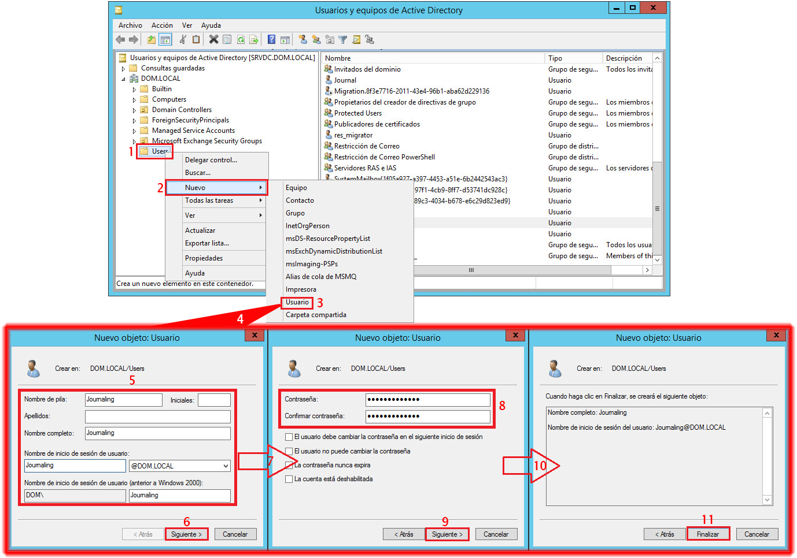
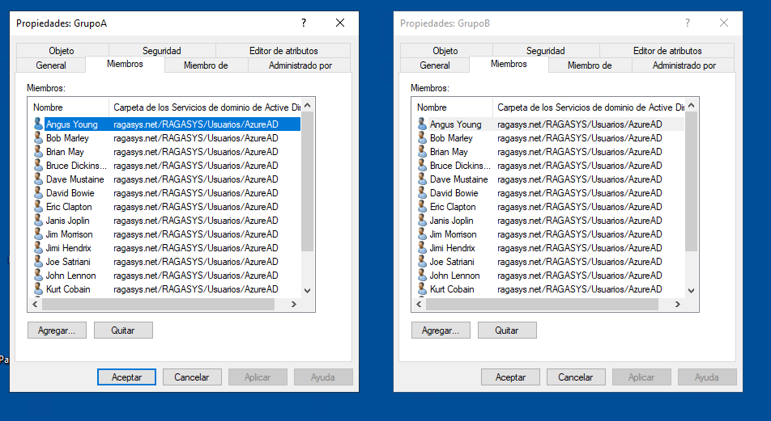

<h1 align="center">💻 Práctica Global</h1>
<h3 align="center"><u>Sistemas Operativos - Tema 1</u></h3>

**Alumno:** TISERA AGUILERA, Adriano Gabriel.

**Legajo:** 59059

**Carrera:** Ingeniería Informática

## 🐧 GNU/Linux
**Crear un script que automatice la creación de usuarios y grupos en GNU/Linux.**

> [!WARNING]
> El script se debe ejecutar con privilegios de superusuario.

Uso:
```bash
curl --fsSL https://raw.githubusercontent.com/AdrianoTisera/PracticaGlobalSO/main/admin.sh | sudo bash
```
Alternativamente:
```bash
git clone https://github.com/AdrianoTisera/PracticaGlobalSO
cd PracticaGlobalSO
sudo bash admin.sh
```
Opciones del script:
```
--user "nombre"           Crear o modificar un usuario.
--group "g1,g2,..."       Crear grupos. (separados por comas)
--list                    Listar usuarios y sus grupos.
--tui                     Abrir la interfaz interactiva.

Ejemplos:
- Crear usuario llamado Mario: --user "mario"
- Crear grupos g1 y g2: --group "g1,g2"
- Crear usuario llamado Mario y añadirlo a los grupos g1 y g2: --user "mario" --group "g1,g2"
```

## 🪟 MS. Windows Server

**¿Cuál es la diferencia entre un usuario y un grupo en Active Directory?**

Un usuario en Active Directory representa una entidad individual, como una persona o una cuenta de servicio. Cada cuenta de usuario tiene credenciales únicas (nombre de usuario y contraseña) y puede iniciar sesión en el dominio para acceder a recursos según los permisos asignados.
Aquí puede observarse la creación de un usuario en Active Directory:


Un grupo en Active Directory, por otro lado, es una colección de cuentas de usuario, cuentas de equipo y otros grupos. Los grupos se utilizan para simplificar la administración de permisos y derechos de acceso. En lugar de asignar permisos a cada usuario individualmente, se asignan al grupo, y todos los miembros heredan esos permisos.
Aquí pueden observarse los usuarios como miembros de diferentes grupos:


**¿Cómo se pueden auditar los accesos a recursos en Active Directory?**

La auditoría de accesos en Active Directory permite registrar y monitorear las acciones realizadas sobre los objetos del directorio, como usuarios, grupos y equipos, fortaleciendo la seguridad y facilitando el cumplimiento de normativas.

Para habilitar la auditoría, se deben configurar dos elementos principales:

1. **Política de auditoría**:  
Se debe activar la política de "Auditar el acceso al servicio de directorio" a través de las Directivas de Grupo. Esto permite que el sistema registre eventos relacionados con el acceso exitoso o fallido a objetos de Active Directory.

2. **Lista de Control de Acceso del Sistema (SACL)**:  
Es necesario definir en cada objeto (usuarios, grupos, unidades organizativas, etc.) qué acciones específicas se auditarán (por ejemplo, lectura, modificación o eliminación). Esto se configura en las propiedades avanzadas de seguridad del objeto.

Una vez implementadas ambas configuraciones, los eventos generados se almacenan en el **Registro de Seguridad** del **Visor de Eventos** de Windows Server, donde pueden ser revisados y analizados. Eventos típicos incluyen modificaciones de atributos de usuario o intentos de acceso no autorizados.

Este proceso permite a los administradores detectar actividades sospechosas, cumplir con normativas de auditoría y mantener la integridad de los recursos de Active Directory.
